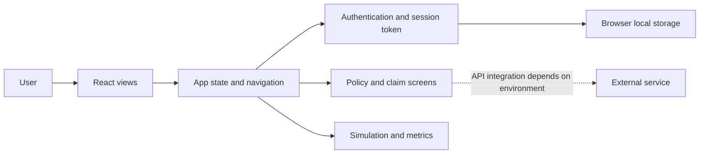

# MemoryLane — Blockchain Insurance Prototype

MemoryLane is a React web application prototype for an insurance workflow. It brings account access, policy management, simulated health or behavioural data, claim submission, claim status, and impact analytics into one interface.

> **Project status:** Frontend prototype. This repository contains a Vite/React client; verify any connected API service separately before using real accounts, policy data, or claims. Do not enter sensitive health or financial information into a demo deployment.

## Features

- Register and sign in through the client interface.
- View a profile and navigate authenticated views.
- Create and browse insurance policies.
- Explore a health/behavioural data simulation.
- Submit a claim and view claim status.
- Review impact metrics.
- Responsive navigation for desktop and mobile layouts.

## Architecture



The Vite entry point mounts `src/App.tsx`. The app selects a view from client-side state and passes shared session, user, navigation, and message handlers to components under `src/components/`. The client stores its session token and user snapshot in browser local storage. Local storage is not secure storage and does not replace server-side authorization.

## Technology

- React 18, TypeScript, Vite
- Tailwind CSS
- Lucide React icons

## Run locally

Prerequisites: Node.js 18+ and npm.

```bash
git clone https://github.com/Prem7105/Memory-Lane.git
cd Memory-Lane
npm install
npm run dev
```

Open the local URL printed by Vite. Other available commands:

```bash
npm run build
npm run preview
npm run lint
```

## Repository layout

```text
src/
├── App.tsx                 # View routing, shared state and session handling
├── main.tsx                # React application entry point
└── components/             # Auth, policy, claim, profile and analytics views
```

## Data and security notes

This repository is a UI prototype, not an insurance provider or medical decision system. Confirm the API contract and server-side controls before connecting a backend. Never commit credentials or real personal, health, or claim data. For production, use secure server-managed sessions, access controls, input validation, audit logging, and an approved privacy and retention policy.
